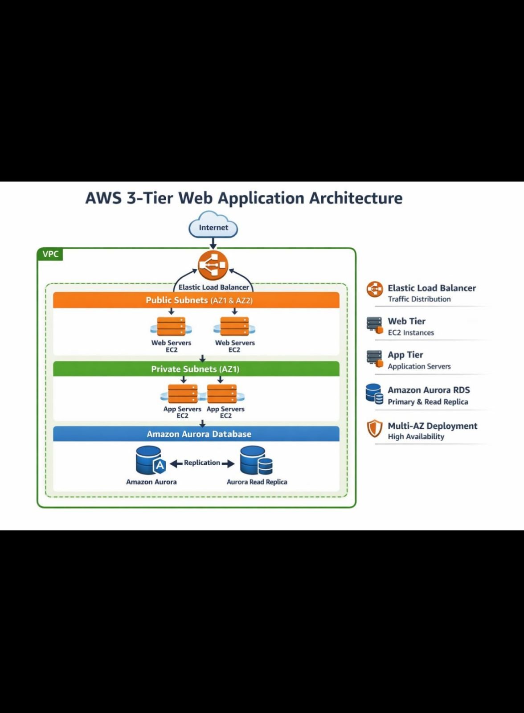

# 🚀 AWS 3-Tier Web Application Deployment

## 📌 Project Overview
This project demonstrates the deployment of a highly available and scalable **3-tier web application architecture on AWS**.

The architecture follows best practices including:
- Multi-AZ deployment
- Load balancing
- Secure network design using VPC
- Scalable EC2 instances
- Managed database using Amazon Aurora

---

## 🏗️ Architecture Diagram

---

## ⚙️ Architecture Components

### 🌐 1. VPC (Virtual Private Cloud)
- Custom VPC with CIDR block
- Public and Private subnets across multiple Availability Zones

---

### 🌍 2. Public Subnet (Web Tier)
- Hosts **EC2 Web Servers**
- Internet-facing
- Connected via **Elastic Load Balancer**

---

### ⚖️ 3. Elastic Load Balancer
- Distributes incoming traffic across multiple web servers
- Ensures high availability and fault tolerance

---

### 🔐 4. Private Subnet (App Tier)
- Hosts **Application Servers (EC2)**
- No direct internet access
- Communicates with Web Tier securely

---

### 🗄️ 5. Database Tier
- **Amazon Aurora (RDS)**
- Primary DB + Read Replica
- Multi-AZ deployment for high availability

---

## 🔄 Workflow

1. User sends request via Internet
2. Request hits **Load Balancer**
3. Load Balancer forwards traffic to **Web Tier**
4. Web Tier communicates with **App Tier**
5. App Tier interacts with **Aurora Database**
6. Response flows back to the user

---

## 🔐 Security Features

- Security Groups for each tier
- Private subnets for App & DB
- No direct DB exposure to internet
- Controlled traffic between layers

---

## 📈 Key Features

- High Availability (Multi-AZ)
- Scalability using Load Balancer
- Secure Architecture
- Fault Tolerant Design

---

## 🛠️ Tools & Services Used

- AWS VPC
- EC2
- Elastic Load Balancer
- Amazon Aurora (RDS)
- Auto Scaling (optional if used)
- Security Groups

---

## 🚀 How to Deploy 

1. Create VPC with subnets
2. Launch EC2 instances for web & app
3. Configure Load Balancer
4. Setup Aurora DB
5. Configure Security Groups
6. Deploy application

---

## 👨‍💻 Author

**Abin VA**  
📧 abinvaliyaraa@gmail.com  
🔗 https://www.linkedin.com/in/abin-va-37b502354

---

## ⭐ Conclusion

This project showcases my ability to design and deploy a production-ready cloud architecture using AWS best practices.
